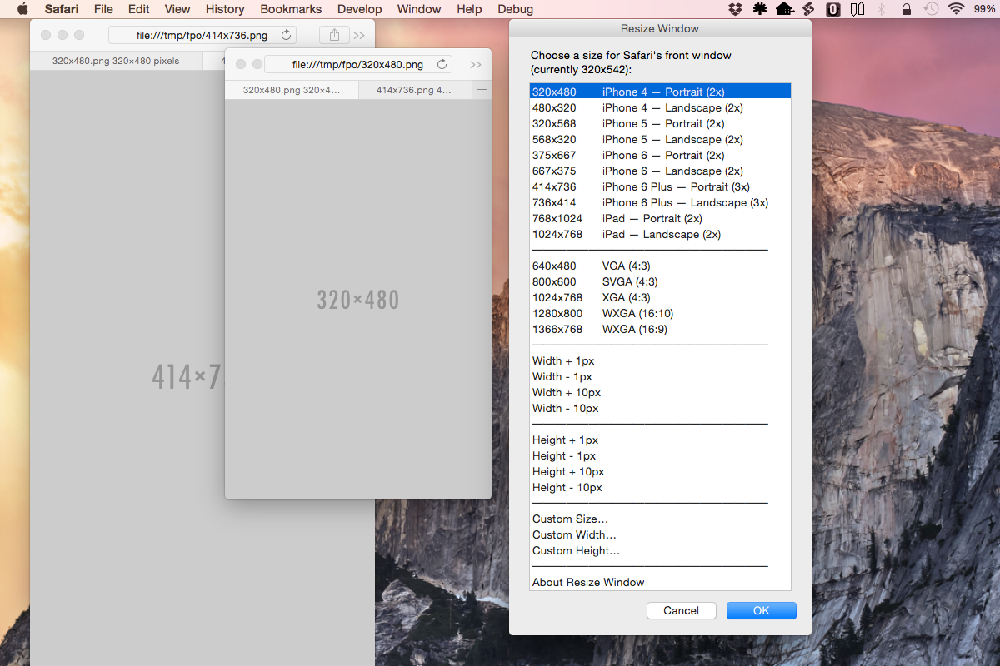
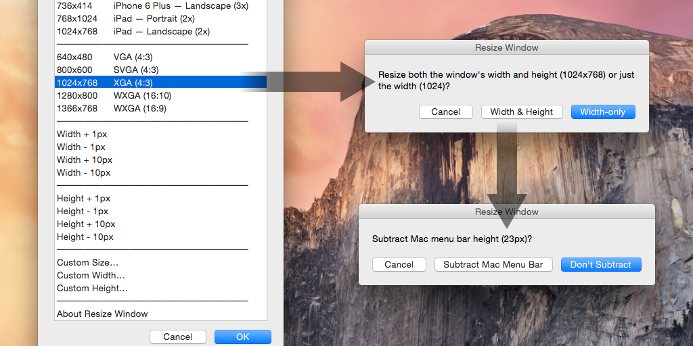
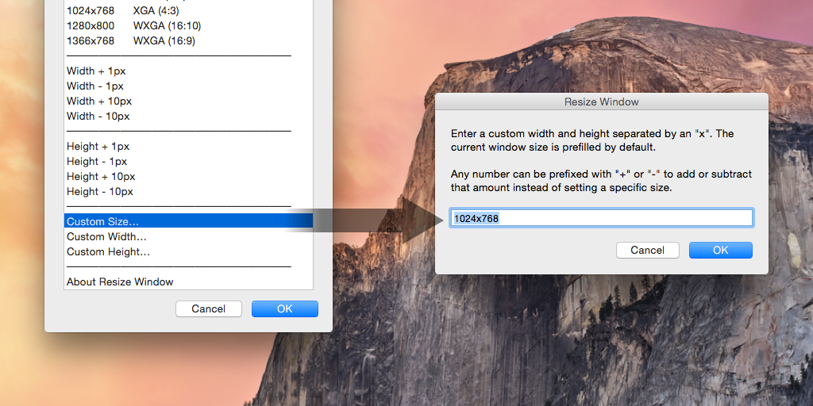
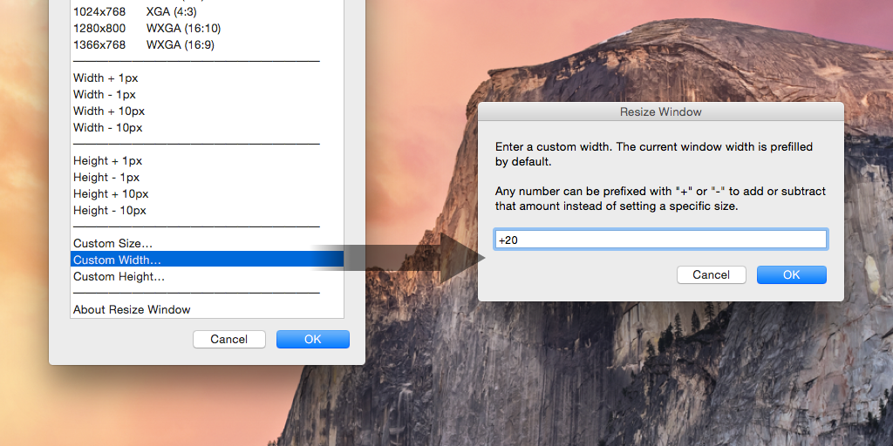
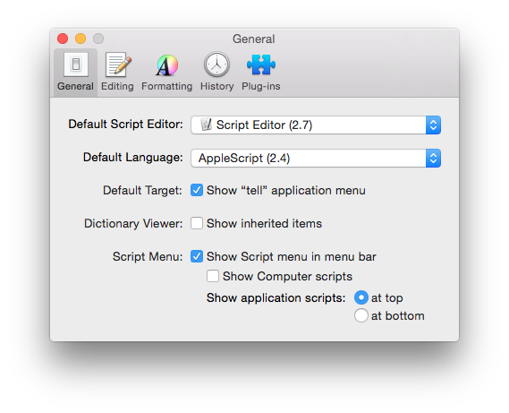
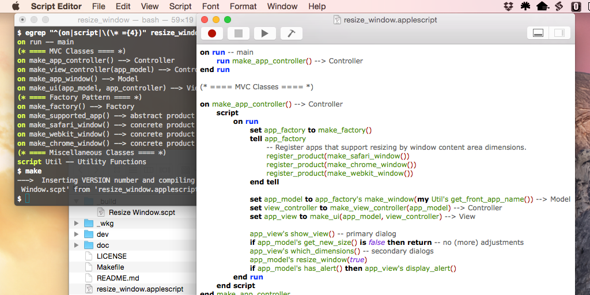

Resize Window
=============

[Resize Window][website] is an AppleScript program for Mac OS X that quickly
resizes the frontmost window of any application to some common sizes as well as
custom sizes and increments. Although the script works with any Mac
application, it is most useful for resizing web browser windows while designing
responsive websites that adapt to different sizes.


Features
--------

* Select from a list of common web browser window sizes, both mobile and
  desktop.

* For the preconfigured mobile sizes, windows for supported apps (Safari and
  Google Chrome) will be resized by the inner window content area. For desktop
  sizes and all other apps, the overall window frame is resized to the selected
  dimensions.

* Choose to adjust only the width or both the width and the height.

* When adjusting the height, choose whether or not to subtract the OS X menu
  bar height.

* Increment the width or height plus or minus 1 pixel or 10 pixels.

* Increment/decrement the width, height, or both by custom values.

* Specify a custom width and/or height.


Screen Shots
------------

Resize windows by preconfigured mobile sizes:

  

Resize windows by preconfigured desktop sizes:

  

Resize windows by custom sizes:

  

Resize windows by custom widths, heights, or increments (custom width increment
shown here):

  


Installation
------------

### Compile and Install the Script

To compile and install the script, `cd` into the directory containing the
source code and run:

```bash
$ make
$ make install
```

That uses `osacompile` to create a compiled AppleScript named "Resize
Window.scpt" from the source file and installs it in a
`~/Library/Scripts/General` directory.

### Enable the Script Menu

If you're not already using a third-party script runner, enable Apple's Script
menu. The procedure for enabling the menu is different depending on which
version of Mac OS X you're running. For Snow Leopard (10.6) and later, it is a
preference setting in the Script Editor app called "Show Script menu in menu
bar":

  


Development
-----------

This script is written using object-oriented design patterns including
Model-View-Controller (MVC) and the Factory Pattern.

  


Bugs
----

Please report any bugs using the GitHub [issue tracker].


Credits
-------

Resize Window was written by [Steve Wheeler](http://www.swheeler.com/).


License
-------

Copyright &copy; 2014--2016 Steve Wheeler.

This program is free software available under the terms of a BSD-style
(3-clause) open source license. See the [LICENSE] file for details.


  [website]: http://jazzheaddesign.com/work/code/resize-window/
  [issue tracker]: https://github.com/jazzhead/resize-window/issues
  [LICENSE]: LICENSE
