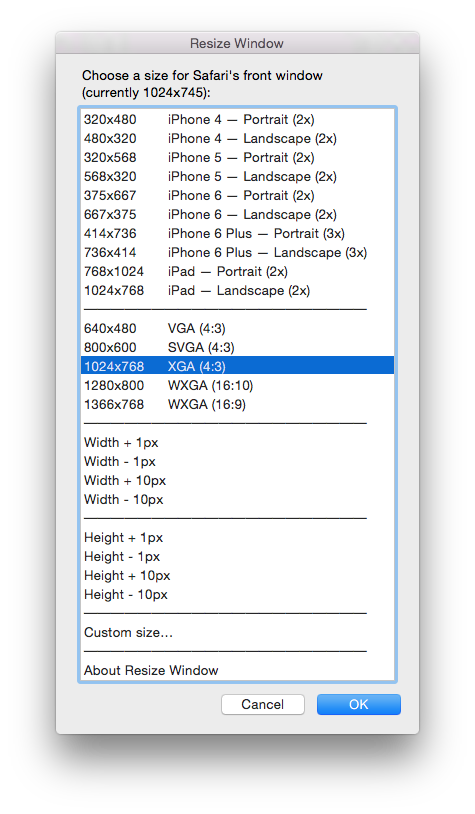
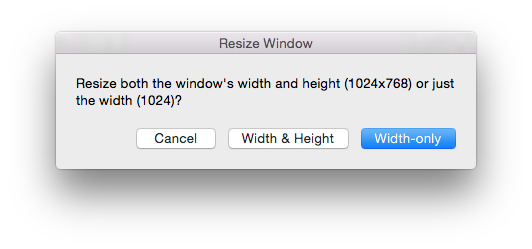
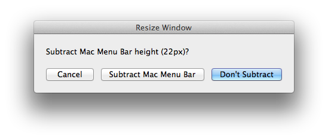
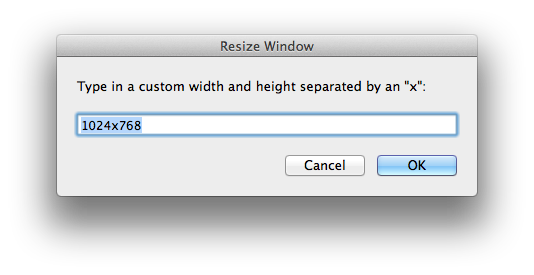
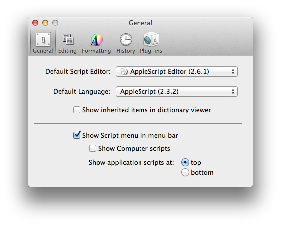

Resize Window
=============

**Version:**       |  @@VERSION@@
**Released:**      |  @@RELEASE_DATE@@
**Author:**        |  Steve Wheeler
**Website:**       |  [jazzheaddesign.com][website]
**Requirements:**  |  Mac OS X

  [website]: http://jazzheaddesign.com/work/code/resize-window/

Description
-----------

Resize Window is an AppleScript program for Mac OS X that quickly resizes the
frontmost window of any application to some common sizes as well as custom
sizes and increments. Although the script works with any Mac application, it is
most useful for resizing web browser windows while designing responsive
websites that adapt to different sizes.

Features
--------

* Select from a list of common browser window sizes.
* Increment the width plus or minus 1 pixel or 10 pixels.
* Type in a custom width and height.
* Choose to adjust only the width or both the width and the height.
* When adjusting the height, choose whether or not to subtract the OS X menu
  bar height.
* Display the current window size.

<!--
The following horizontal rule is a kludge to get a paragraph space in the RTF
file. It is replaced with just an empty paragraph, not an RTF horizontal rule.
-->

---

_Note: The sizes refer to the overall size of the window and not the interior
document size minus the window chrome. So the smaller sizes are mostly useful
for just testing the width for mobile devices. A few FPO images are included
along with the script though for loading into a browser window and quickly
eyeballing the fit and manually adjusting the window height._

Screen Shots
------------

  

  

  

  

Installation
------------

### Create the Installation Folder

The script needs to be installed in the Scripts folder in the Library folder of
your home directory. Since the script can be used with any application, if you
like to keep your scripts grouped, you may want to put it in a subdirectory
such as "General", i.e., `~/Library/Scripts/General`. If any of those folders
do not exist yet on your system, go ahead and create them. The Library folder
will already exist but may not be visible in the Finder in Mac OS X Lion (10.7)
or later. To get to the invisible Library folder, Option-click the Finder's Go
menu and select the Library menu item that appears.

### Install the Script

Double-click to expand the downloaded .zip archive. Move the script file to the
folder created above. You can also move this README file to the same location
to easily find it if you need it.

### Enable the Script Menu

If you're not already using a third-party script runner, enable Apple's Script
menu. The procedure for enabling the menu is different depending on which
version of Mac OS X you're running. For Snow Leopard (10.6) and later, it is a
preference setting in the AppleScript Editor app called "Show Script menu in
menu bar":

  

Bugs
----

Please report any bugs using the GitHub [issue tracker].

  [issue tracker]: https://github.com/jazzhead/resize-window/issues

Credits
-------

Resize Window was written by [Steve Wheeler](http://www.swheeler.com/).

License
-------

This program is free software available under the terms of a BSD-style
(3-clause) open source license detailed below.

---

